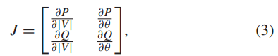
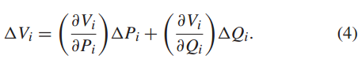
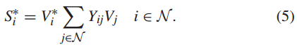
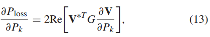
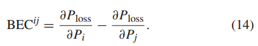

# 基本信息

19年9月；TSG；Guerrero；澳洲电气

# 关键词

sensitivity analysis

# 主要信息

①去中心化市场交易平台：区块链和其他技术。

**②第一篇提出分布式交易与网络约束的。**

③电压/功率/损耗敏感性矩阵的具体计算过程。

④用得是cda算法。

⑤越限的直接舍弃。

# 摘抄

In particular, recent trends in cryptocurrencies and blockchain have led to a proliferation of peer-to-peer (P2P) energy trading schemes, which allow the exchange of energy between the neighbors without any intervention of a conventional intermediary in the transactions.

> 特别是，加密货币和区块链的最新趋势导致点对点（P2P）能源交易方案激增，该方案允许邻居之间进行能源交换，而无需传统中介机构干预交易。

This paper proposes a methodology based on **sensitivity analysis** to assess the impact of P2P transactions on the network and to guarantee an exchange of energy that does not violate network constraints. The proposed method is tested on a typical U.K. low-voltage network.

> 本文提出了一种基于敏感性分析的方法来评估P2P交易对网络的影响并保证能量交换不违反网络约束。所提出的方法在典型的英国低压网络上进行了测试。

Nevertheless, there are still some elements of debate such as the market framework, and how **external cost** due to the power exchange and network coupling constraints (from the AC power flow) can be associated with the transactions.

> 尽管如此，仍然存在一些争议因素，例如市场框架，以及由于电力交换和网络耦合约束（来自交流潮流）而产生的外部成本如何与交易相关联。

**To our knowledge, this is the first model that integrates decentralized P2P energy trading with network constraints.** Previous research either only focused on the DLTs technologies or did not consider the network constraints.

> 据我们所知，这是第一个将去中心化P2P能源交易与网络约束相结合的模型。之前的研究要么只关注分布式账本技术，要么没有考虑网络限制

## Introduction：

Currently, the implementation of decentralized market platforms is possible due to new advances in information and communication technology, such as blockchain and other distributed ledger technologies (DLTs), which support transparent and decentralized transactions.

> 目前，由于信息和通信技术的新进步，例如支持透明和去中心化交易的区块链和其他分布式账本技术（DLT），去中心化市场平台的实施成为可能。

Additionally, commercial P2P trading pilots projects have also been implemented recently. Most of these create a cryptocurrency that is used to trade energy between users.

> cryptocurrency：加密货币
>
> 此外，商业化P2P交易试点项目近期也已落地。其中大多数创建了一种加密货币，用于在用户之间交易能源。

In response to this shortcoming, in this paper, we extend the existing P2P energy trading scheme by explicitly taking into account the underlying network constraints at the distribution level. Moreover, each transaction will be charged with the extra costs associated with the physical energy exchanged (i.e., due to losses).

> 针对这一缺点，在本文中，我们通过明确考虑配电层面的底层网络约束来扩展现有的 P2P 能源交易方案。所有交易都必须在投标过程中根据网络状况进行验证。此外，每笔交易都将收取与交换的物理能量相关的额外成本（即由于损失）。

## Contribution：

We illustrate the importance of including network constraints in the models of P2P trading to prevent voltage and capacity problems in the network;

> 我们说明了在 P2P 交易模型中包含网络约束以防止网络电压和容量问题的重要性；

We propose a novel methodology based on sensitivity analysis to assess the impact of the transactions on the network and to internalize the external cost associated with the energy exchange;

> 我们提出了一种基于敏感性分析的新颖方法，以评估交易对网络的影响，并将与能源交换相关的外部成本内部化；

We present the benefits that P2P trading under network constraints may bring to power systems and end-users, by comparing our method with other strategies proposed to prevent upcoming LV network issues;

> 通过将我们的方法与为防止即将出现的低压网络问题而提出的其他策略进行比较，我们展示了网络限制下的 P2P 交易可能给电力系统和终端用户带来的好处；

 

## ①VSC：

The traditional approach to obtain the VSCs is to use the Jacobian matrix after solving the Newton-Raphson power flow [27]

> 获得 VSC 的传统方法是使用 求解 Newton-Raphson 功率流后得到的 Jacobian 矩阵 [27]：

However, running a full load power flow every time the state of the network changes may not be feasible or tractable.

> 然而，每次网络状态发生变化时都运行满载潮流可能不可行或不易处理。

Therefore, in our study, we use the analytical derivation of VSCs proposed in [28]. In doing so, we use the so-called compound admittance matrix. The relation of the power injection and bus voltages is given by

> 因此，在我们的研究中，我们使用[28]中提出的VSC的分析推导。为此，我们使用所谓的复合导纳矩阵。功率注入和母线电压的关系由下式给出：

## ②PTDF：

Specifically, the injection shift factor (ISF) quantifies the redistribution of power through each branch following a change in generation or load on a particular bus. It reflects the sensitivity of a flow through a branch with respect to changes in generation or load. Once we obtain the ISFs, we can calculate the PTDFs, which capture the variation in the power flows with respect to the injection in Bus i and a withdrawal of the same amount at Bus j [29], [30].

> 由于能量交换涉及通过物理路径的功率流，因此 PTDF 可以了解有功功率流对各种变量的敏感性。
>
> 具体来说，注入移位因子 (ISF) 量化特定总线上发电或负载变化后通过每个分支的功率重新分配。它反映了流经支路的流量对发电或负载变化的敏感性。一旦我们获得了 ISF，我们就可以计算 PTDF，它捕获了相对于总线 i 的注入和总线 j 的相同量的撤回的功率流的变化[29]、[30]。

In order to calculate the ISFs, we use the reduced nodal susceptance matrix.

> 为了计算 ISF，我们使用简化的节点电纳矩阵。

Also, denote the branch-to-node incidence matrix by A

> 另外，将分支到节点的关联矩阵表示为A

## ③ISF：

We derived the LSFs using a similar approach to the use above. The term for the LSF is given by [31]: and G is the conductance matrix.

> 我们使用与上述使用类似的方法导出 LSF。 LSF 计算如下[31]，其中G是电导矩阵。

The bilateral exchange coefficient (BEC) can be used to associate the losses due to a bilateral transaction [32].

>  双边交换系数（BEC）可用于关联双边交易造成的损失[32]。

