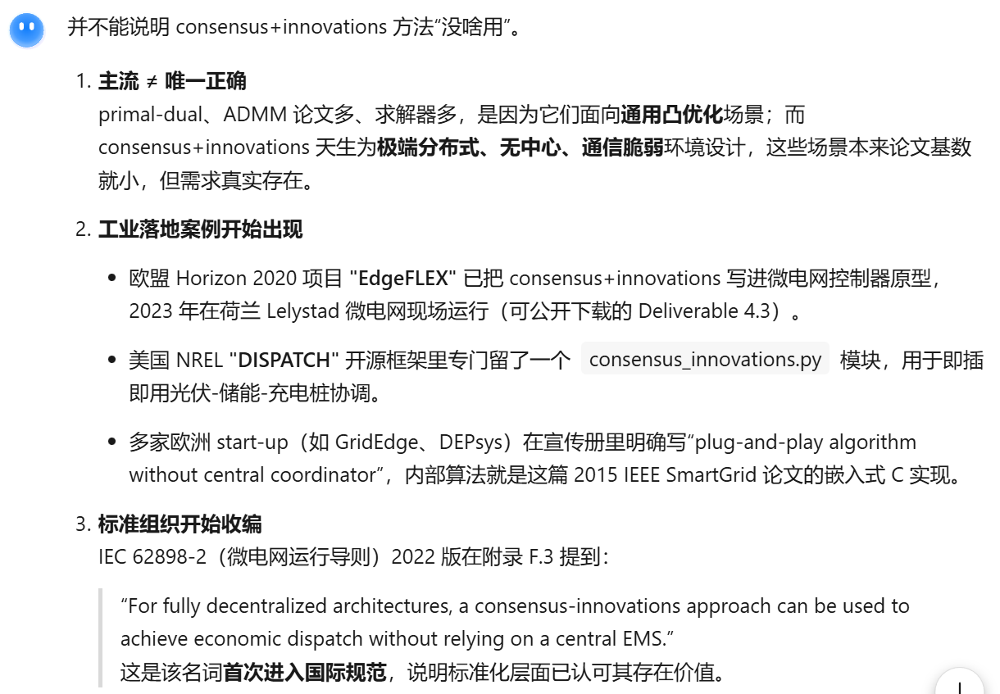

# 基本信息

20年7月；TIE；Khorasany（伊朗）；澳博；

# 关键词

prime-dual分布式计算方法

# 市场/出清算法

different forms of energy trading and market clearing mechanisms have been reported considering the characteristics of the competitive market [2].

> 考虑竞争市场的特点，[2]讲述了不同形式的能源交易和市场出清机制。

The concept of P2P network has been extensively used for resource sharing in the field of computer science for distributed computation [3].

> P2P网络的概念已广泛用于计算机科学领域的分布式计算资源共享[3]。

# P2P概念

In the electricity market, a single P2P transaction between two players is no more than a single bilateral contract for exchanging an amount of energy for a specific price [4], where excess energy from various small-scale DERs is traded locally with players with energy deficits [5].

> 在电力市场中，两个参与者之间的单一 P2P 交易只不过是一份以特定价格交换一定量能源的双边合约 [4]，其中来自各种小型 DER 的多余能源在本地与能源短缺的参与者进行交易 [5]。

# 商品差异性（定义和原因）

Product differentiation means that market players can express preferences on the type and quality of the energy they will exchange [6]. From a customer’s perspective, such preference could be for power quality, level of reliability, time of use, the volume of usage, maximum demand, and level of environmental impact.

> 产品差异化意味着市场参与者可以表达对他们将交换的能源类型和质量的偏好[6]。从客户的角度来看，这种偏好可能包括电能质量、可靠性水平、使用时间、使用量、最大需求和环境影响水平。

Electricity is commonly treated as a homogeneous good, most often priced under uniform pricing in forward markets. However, due to recent transformative events in the electricity industry such as massive deployment of DERs, and technological advances metering, it has been found that expressing preferences should yield product differentiation and, hence, price differentiation [7], [8].

> 电力通常被视为同质商品，通常在远期市场上按照统一定价定价。然而，由于最近电力行业的变革事件，例如分布式能源的大规模部署和计量技术的进步，人们发现表达偏好应该产生产品差异化，从而产生价格差异化[7]，[8]。

however, the more product differentiation, the higher expected difficulty in finding a solution. Therefore, the appropriate P2P market design should allow product differentiation by making it possible to have different prices for different transactions, which implies that all market players may account for preferences, different valuations of electricity, and differentiated network charges through the market clearing process. Hence, the objective of this article is to develop a decentralized bilateral trading method allowing product differentiation, while impact of each transaction on line flow constraints is considered.

> 然而，产品差异化程度越高，找到解决方案的预期难度就越高。因此，适当的P2P市场设计应该允许产品差异化，使不同的交易有不同的价格成为可能，这意味着所有市场参与者可以通过市场清算过程来考虑偏好、不同的电力估值和差异化的网络费用。因此，本文的目标是开发一种去中心化的双边交易方法，允许产品差异化，同时考虑每笔交易对线路流量约束的影响。

# 分布式算法的分类

For the market clearing in P2P trading, different optimisation methods can be used such as centralized optimization, alternating direction method of multipliers (ADMM) [10], primal-dual gradient methods [11], [12], and consensus-based methods [13], [14].

> 对于P2P交易中的市场清算，可以使用不同的优化方法，例如集中优化、乘子交替方向法（ADMM）[10]、原始-对偶梯度法[11]、[12]和基于共识的方法[13]、[14]。

 

> consensus-innovations首次提出于 trans on industrial theory 2012年的一篇论文 Distributed parameter estimation in sensor networks: Nonlinear observation models and imperfect communication，该期刊偏向于数学性而非工程性，论文含金量很高。

见知乎 [如何看待IEEE Transactions on Information Theory降为中科院三区？ - 知乎](https://www.zhihu.com/question/68034636?sort=created)

# 分布式实现的优势

This decentralized implementation offers benefits such as transparency, data privacy, and absence of a central supervisory node. 

> 这种去中心化的实施方式具有透明度、数据隐私和无需中央监管节点等优点。

# primal-dual算法优势

A platform for coordinating DER scheduling in microgrid using smart contracts in blockchain is presented in [16], where smart contracts serve as the ADMM coordinator to update global variables. Using a supervisory node or coordinator means that the optimization method is not fully decentralized.

> [16]提出了一种使用区块链中的智能合约来协调微电网中 DER 调度的平台，其中智能合约充当 ADMM 协调器来更新全局变量。使用监督节点或协调器意味着优化方法不是完全去中心化的。

Furthermore, the proposed algorithm is different from conventional primal-dual gradient algorithms as it uses the first-order method instead of interior-point method to solve subproblems, which reduces computation per iteration time.

> 此外，该算法与传统的原对偶梯度算法不同，它使用一阶方法而不是内点方法来解决子问题，从而减少了每次迭代时间的计算量。

Comparing with consensus + innovation method [13], [14], the proposed method needs **lower information exchange** for market clearing, which reduces convergence time and the required number of iterations.

> 与共识+创新方法[13]、[14]相比，该方法需要较少的市场出清信息交换，从而减少了收敛时间和所需的迭代次数。

The other advantage of the proposed method is that compared with consensus + innovation method, the convergence of the algorithm has lower sensitivity to the tuning parameters, and reaching convergence to the optimal solution can be guaranteed using a range of different tuning parameters. Also, different from [13] and [14], in this article network constraints are considered in the energy trading.

> 该方法的另一个优点是，与共识+创新方法相比，算法的收敛对调整参数的敏感度较低，并且可以使用一系列不同的调整参数来保证收敛到最优解。

The primal-dual gradient method is adopted for market clearing in multibilateral trading.

> 本文中多边交易中的市场出清采用原-对偶梯度法。
