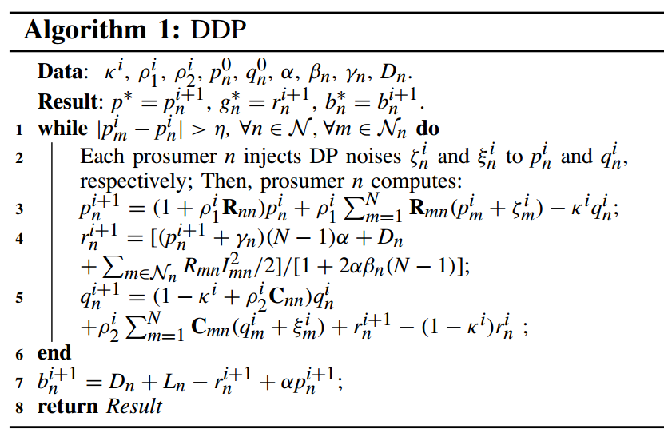

# 基本信息

25年11月；TSG；港中文；

# 关键词

差分隐私P2P；广义Nash博弈；变分不等式；分布式算法；资源分配；单向信息传递

# 评价

对单个prosumer进行建模；

然后使用了kkt条件，得到（n+1）个方程解（n+1）个未知数；

然后使用差分隐私，特点是，传递的数据模糊了，但是模糊的数据并不影响算法收敛；

难度很大，属于算法的部分内，其中证明了变分不等式的解存在且唯一；

差分隐私分布式算法可以达到$\epsilon$差分隐私

# 内容

所有prosumer n最小化其成本，(1b)是出清约束，(1c)是能量守恒，(1d)是功率损耗；
$$
\begin{align}
\min_{(b_n, g_n)} u_n &= p \cdot (-\alpha \cdot p + b_n) + \mathcal{L}(g_n), \tag{1a} \\
\text{s.t.} & \sum_{n \in \mathcal{N}} (-\alpha \cdot p + b_n) = 0, \tag{1b} \\
& g_n - \alpha \cdot p + b_n - L_n - D_n = 0, \tag{1c} \\
& L_n = \sum_{m \in \mathcal{N}_n} (R_{mn} \cdot I_{mn}^2)/2. \tag{1d}
\end{align}
$$
$b_n,g_n$分别代表prosumer-n的bidding价格和净产电量；

p是价格，$D_n$是需求，$L_n$是损失，b是bidding price，交易成本$p(-\alpha p+b_n)$；产电成本是关于$g_n$的二次函数；

交易价格$p=\sum_{n=1}^N b_n/N\alpha$

# 算法

