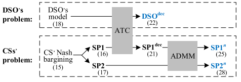

# 基本信息

22年7月；power system；zhang（安徽大学硕士）；co author（Shahidehpour Mohammad）

# 关键词

灵活性量化；ATC-ADMM

# ATC介质

First, the CSs-DSO bi-level model is decoupled by ATC with tie-line power being the only exchanged information;

> 首先，CSs-DSO 双层模型由 ATC 解耦，tie-line功率是唯一交换的信息

# 大量电车

To provide charging service for EVs, an increasing number of charging stations with fast chargers and supper chargers have been deployed in distribution systems [2], [3].

> 为提供电动汽车的充电服务，越来越多的带有快速充电器和超级充电器的充电站已部署在配电系统中[2]，[3]。

On the one hand, due to the random charging behavior of EVs, the increasing penetration of EVs and CSs may bring the issue of enlarged peak-valley difference of load [4]; on the other hand, with V2G technology, the large-scale connected EVs have a large potential to act as energy storage resources for enhancing the flexibility of power systems [5].

> 一方面，由于电动汽车的随机充电行为，电动汽车和CS的普及率不断提高可能会带来负荷峰谷差扩大的问题[4]；另一方面，借助V2G技术，大规模联网电动汽车有很大潜力作为储能资源，增强电力系统的灵活性[5]
