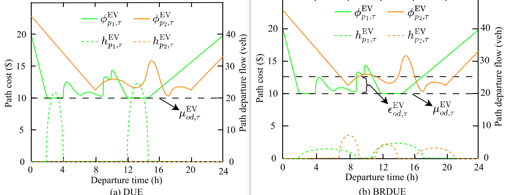
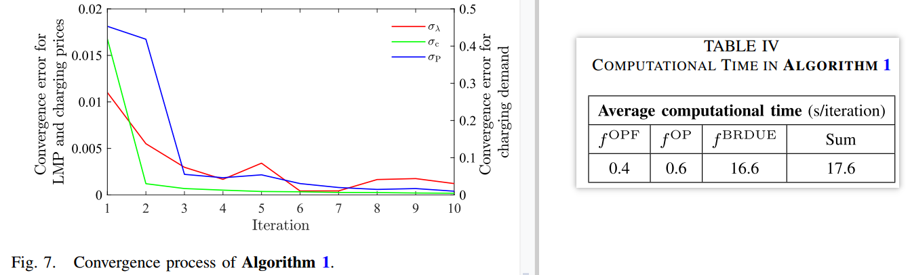
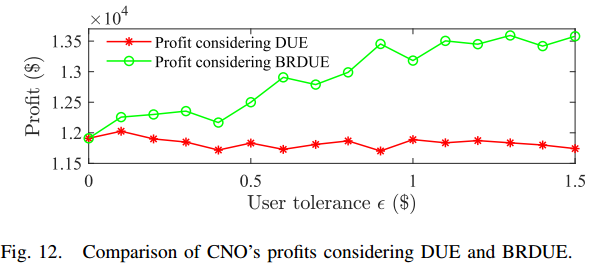

# 基本信息

[1] Y. Chen, S. Hu, S. Xie, Y. Zheng, Q. Hu, and Q. Yang, “Optimal Dynamic Pricing of Fast Charging Stations Considering Bounded Rationality of Users and Market Regulation,” *IEEE Trans. Smart Grid*, vol. 15, no. 4, pp. 3950–3965, Jul. 2024.

24年7月；smart grid；Xie Shiwei(福州大学)

# 关键词

双网耦合定价问题；有限理性；市场监管；

# 模型

### PDN和DSO

$$
\min \mathcal{O}_P = \sum_{t \in \mathcal{T}} \sum_{V_i^P \in V^P} \left\{ a_i \left[ P_i^G(t) \right]^2 + b_i P_i^G(t) \right\} \Delta t + \sum_{t \in \mathcal{T}} b_0 P_0^G(t) \Delta t  \\
\text{s.t.}  \quad P_i(t) - P_i^G(t) + \sum_{j \in \pi(i)} P_{ij}(t) = 0  \\
P_i(t) = P_i^{\text{con}}(t) + P_i^{\text{ch}}(t) \\
\delta_i(t) - \delta_j(t) = P_{ij}(t) X_{ij}\\
0 \leq P_i^G(t) \leq \overline{P}_i^G  \\
|P_{ij}(t)| \leq \overline{P}_{ij}  \\
|\delta_i(t)| \leq \overline{\delta}
$$

> （1）：产电成本+上级电网的购电成本
>
> （2）：load-G+所有流出的功率流；
>
> （3）：load=常规+充电；
>
> （4）：$\delta$是电压相角

### TN和有限理性DUE

$$
\mathcal{H} = \left\{ h_{p,\tau}^{v} : p \in \text{Path}_{od}^{v}, v \in \{\text{GV}, \text{EV}\}, (o,d,\tau) \in (O,D,\Gamma) \right\} \in \Lambda
$$

其中$\Lambda$ 是$\mathcal{H}$的可行域   ，即
$$
\Lambda = \left\{ \mathcal{H} : 
\begin{split}
&h_{p,\tau}^{v}(t) \geq 0, \forall t \in \mathcal{T}, p \in \text{Path}_{od}^{v}; \\
 &\sum_{p \in \text{Path}_{od}^{v}} \sum_{t \in \mathcal{T}} h_{p,\tau}^{v}(t) = |W^{v}(o,d,\tau)|, \forall v \in \{\text{GV},\text{EV}\}, (o,d,\tau) \in (O,D,\Gamma) 
\end{split}\\ \right\}
$$

>$\mathcal{H}$是路径-出发流的集合（可以理解成真实世界的流量状态），$\tau$是目标到达时间
>
>用户按照v和（o,d,τ）分组，用$W^v(o,d,\tau)$表示
>
>|X|是集合X的基数，代表这个集合的成员数量

用有限理性DUE表征
$$
\begin{aligned}
& h_{p,\tau}^{*}(t) > 0 \Rightarrow \phi_{p,\tau}^{v}(t) \in [\mu_{od,\tau}^{v}, \mu_{od,\tau}^{v} + \varepsilon_{od,\tau}^{v}] \\
& \forall t \in \mathcal{T}, p \in \text{Path}_{od}^{v}, v \in \{\text{GV}, \text{EV}\}, (o,d,\tau) \in (O,D,\Gamma)
\end{aligned}
$$

> $\phi$ 是旅行成本，$\varepsilon$是用户对旅行成本可接受差异（即不敏感）的有限理性，$\mu$是$\phi$的基本下确界（几乎处处成立的下确界）

该式子可以转换成为变分不等式问题：找到一个$\mathcal H^*\in\Lambda$使得
$$
\sum_{\substack{v \in \{GV, EV\} \\ (o,d,\tau) \in (O,D,\Gamma)}} \sum_{p \in \text{Path}_{od}^v} \sum_{t \in \mathcal{T}} \phi_{p,\tau}^{v,\varepsilon}(t) \left[ h_{p,\tau}^{v*}(t) - h_{p,\tau}^v(t) \right] \geq 0
$$
在$\forall \mathcal H\in\Lambda$成立，其中$\phi_{p,\tau}^{v,\varepsilon}(t)=\max(\phi_{p,\tau}^{v}(t),\mu_{od,\tau}^{v} + \varepsilon_{od,\tau}^{v})$是有容忍的旅行成本；

> 此处省略了旅行成本含旅行时间成本-不准时成本-充电成本，时刻可以利用动态网络加载（DNL）的方式获得

> 此处省略了旅行时间（BRP/点队列）-等待时间（戴维森/点队列）。

然而，正如[34]中所建议的，解决 DUE 或 BRDUE 可能是 NP -hard的。路径到达时间和充电终止时间不能以封闭形式获得，应通过计算过程进行数值评估[35]。解决 DUE 问题时通常采用不动点算法，其可以表示为
$$
\mathcal{H}^* = P_\Lambda \left[ \mathcal{H}^* - \alpha \Phi(\mathcal{H}^*, c) \right]
$$

> $P_\Lambda$是对$\Lambda$的最小范数映射，$\alpha$是步长常数，$\Phi(\mathcal H,c)$是旅行成本矩阵（由DNL过程中的路径-出发流矩阵，和充电价格所决定）

上述方程可以由下列迭代求解[36]
$$
h_{p,\tau}^{v,n+1}(t)=\left[h_{p,\tau}^{v,n}(t)-\alpha\phi_{p,\tau}^{v,\varepsilon,n}\left(t,\mathcal{H}^{n},\mathcal{C}^{n}\right)+s_{v,n+1}^{d,\tau}\right]_{+}
$$

> $s_{v,n+1}^{d,\tau}$是常数用于确保更新的$\mathcal{H}$满足给定的流量需求，$[x]_+=\max(0,x)$,
>
> 上式将会收敛到BRDUE。

### CNO定价

$$
\begin{align}
&c^{\mathrm{opt}} = \arg\max_{c \in \Omega^{\mathrm{opt}}} \mathcal{O}_{\mathrm{ch}} = \sum_{t \in \mathcal{T}} \sum_{V_i^{\mathrm{ch}} \in V^{\mathrm{ch}}} \left[ c_i(t) - \lambda_{\omega(i)}(t) \right] p_i^{\mathrm{T,ch}}(t) \Delta t\\
&\text{s.t.}\quad
\underline{c} \leq c_i(t) \leq \overline{c},\; \forall V_i^{\mathrm{ch}} \in V^{\mathrm{ch}},\; t \in \mathcal{T}\\
&\frac{1}{|\mathcal{T}||V^{\mathrm{ch}}|} \sum_{t \in \mathcal{T}} \sum_{V_i^{\mathrm{ch}} \in V^{\mathrm{ch}}} c_i(t) \leq c^{\mathrm{av}} = \frac{\underline{c} + \overline{c}}{2}\\
&\begin{cases}
& \sum_{t \in \mathcal{T}} \sum_{V_i^{\mathrm{ch}} \in V^{\mathrm{ch}}} c_i(t) P_i^{\mathrm{T,ch}}(t) \Delta t \leq \overline{\theta} \\
& \overline{\theta} = \chi c_{\mathrm{av}} P_{\mathrm{ch}} \tau^{\mathrm{ch}} \sum_{v \in \mathcal{V}} W^v(o, d, \tau)
\end{cases}
\end{align}
$$

> 最大化收益；时间和站点的平均价格小于均值；用户费用小于均值（$\chi$代表管制参数，越小越严格）；

### 三层Stackelberg博弈

$$
\begin{equation}
\left\{
\begin{aligned}
\lambda &= f^{\mathrm{OPF}}(p^{\mathrm{ch}}) :  p^{\mathrm{ch}} 
\xrightarrow[\mathrm{QP}]{\mathrm{DCOPF}} p^G 
\xrightarrow[\mathrm{QP}]{\mathrm{Dual}} \lambda \\
c &= f^{\mathrm{OP}}(\lambda, p^{\mathrm{ch}}) :  (\lambda, p^{\mathrm{ch}}) 
\xrightarrow[\mathrm{LP}]{\mathrm{OP}} c \\
p^{\mathrm{ch}} &= f^{\mathrm{BRDUE}}(c) :  c 
\xrightarrow[\mathrm{VI}]{\mathrm{BRDUE}} \mathcal{H}^* 
\xrightarrow[\mathrm{DNL}]{\mathrm{DNL}} p^{\mathrm{ch}}
\end{aligned}
\right.
\end{equation}
$$

### 带惯性权重的高斯-赛德尔算法

DSO 和 CNO 的优化问题是凸的（分别是 QP 和 LP）并且可以很容易地解决。然而，**BRDUE问题是一个VI问题**，不能像UE问题一样重新表述为等效的凸优化问题。在这方面，设计了带有惯性权重的高斯-赛德尔迭代算法来解决第 III-D 节中制定的三级 Stackelberg 博弈，其中 CNO 的最优动态定价问题被重新表述为不动点模型。
$$
c = f^{\mathrm{OP}}\left( f^{\mathrm{OPF}}\left( f^{\mathrm{DUE}}(c) \right), f^{\mathrm{BRDUE}}(c) \right) = \Psi(c)
$$

>$\Psi$是输入为c，输出为c的自映射；

#### 布劳威尔不动点定理(Brouwer’s fixed-point theorem)

**Theorem 1 (Brouwer): For a continuous mapping f from a compact and convex set S ⊂ Rn to itself, there exists a point s∗ ∈ S such that s∗ = f(s∗).**

> 定理 1 (Brouwer)：对于从紧凸集 S ⊂ Rn 到自身的连续映射 f，存在一个点 s* ∈ S 使得 s* = f(s*)。

**一般采用Gauss-Seidel迭代方法来求解Stackelberg博弈的均衡[19]、[37]**，其中先前计算的结果可以在当前迭代中使用以加速收敛。为了找到（35）的不动点，算法1中提出了一种带有惯性权重的Gauss-Seidel迭代算法。$\beta_c$ ∈ [0, 1]是一个惯性权重，用于抑制振荡并控制更新步长，如[23]中所建议的。 $c^{k+1}$的更新基于更新的$\lambda^{k+1}$，这是Gauss-Seidel迭代方法的关键特征。

应该指出的是，**应用于不动点问题的迭代方法的理论收敛性在很大程度上取决于映射的连续性**。在这方面，本文研究的映射近似连续（分段连续），因此提出的算法1可能在极少数情况下由于振荡而无法收敛。同样，[4]、[23]中的相关研究在处理不动点问题时也遇到了振荡问题。在工程应用中，当算法1无法收敛时，建议CNO在迭代得到的解中选择利润最大的次优解（定价方案）。

| 算法1 带惯性权重的高斯-赛德尔迭代算法                        |
| ------------------------------------------------------------ |
| 1. 设置最大迭代次数 $N$、收敛阈值 $\overline{\sigma}$、惯性权重 $\beta_c$ 和迭代计数器 $k = 1$。 |
| 2. 设置初始值：  $$\begin{cases}p^{\mathrm{ch},0} &= \{ P_i^{\mathrm{T,ch},0}(t) = P_{\mathrm{ch}} N_i^{\mathrm{ch}} / 2,\; \forall V_i^{\mathrm{ch}} \in V^{\mathrm{ch}},\; t \in \mathcal{T}\}\\\lambda^0 &= f^{\mathrm{OPF}}(p^{\mathrm{ch},0})\\c^0 &= f^{\mathrm{OP}}(\lambda^0, p^{\mathrm{ch},0})\end{cases} $$ |
| 3. 根据给定的充电需求 $p^{\mathrm{ch},k}$，通过求解 DCOPF 问题更新节点电价 $\lambda$：   $\lambda^{k+1} = f^{\mathrm{OPF}}(p^{\mathrm{ch},k})$ |
| 4. 利用更新后的 LMP $\lambda^{k+1}$ 和给定的充电需求 $p^{\mathrm{ch},k}$，通过求解线性规划（LP）问题更新充电价格 $c$：   $c^{k+1} = (1 - \beta_c)c^k + \beta_c f^{\mathrm{OP}}(\lambda^{k+1}, p^{\mathrm{ch},k})$ |
| 5. 利用更新后的充电价格 $c^{k+1}$，通过求解 BRDUE 问题更新充电需求 $P^{\mathrm{ch}}$：   $p^{\mathrm{ch},k+1} = f^{\mathrm{BRDUE}}(c^{k+1})$ |
| 6. 计算迭代误差 $\sigma$，若满足： $$\left\{ \begin{aligned} \sigma_\lambda^{k+1} &= \|\lambda^{k+1} - \lambda^k \|^2 / \|\lambda^k \|^2 \leq \overline{\sigma}_\lambda \\ \sigma_c^{k+1} &= \|c^{k+1} - c^k \|^2 / \|c^k \|^2 \leq \overline{\sigma}_c \\ \sigma_p^{k+1} &= \|p^{\mathrm{ch},k+1} - p^{\mathrm{ch},k} \|^2 / \|p^{\mathrm{ch},k} \|^2 \leq \overline{\sigma}_p \end{aligned} \right. \quad \text{或} \quad k > N$$ 则停止迭代。 |
| 7. 返回最优动态定价方案 $c^* = c^k$。                        |

> $\beta_c$ ∈ [0, 1]是一个惯性权重，用于抑制振荡并控制更新步长；
>
> 说白了就是交替优化；

收敛速度挺快的。

### 附录A

| 算法2 用户容忍度自适应估计                                   |
| ------------------------------------------------------------ |
| 1. 收集交通调查的历史统计数据，包括：车辆类型 $v$、起点 $o$、终点 $d$、目标到达时间 $\tau$、路径选择 $p$、FCS 选择 $q(p)$、出发时间 $t$ 和到达时间 $\xi_p^{\prime}(t)$。 |
| 2. 根据公式计算每个用户的出行成本。用户 $u$ 的出行成本记为 $\phi(u)$。 |
| 3. 将所有用户划分为若干组，具有相同 $v, o, d, \tau$ 的用户归为同一组 $W^v(o,d,\tau)$。 |
| 4. 对每组 $W^v(o,d,\tau)$ 估计用户容忍度 $\epsilon_{od,\tau}^v$：  $$\epsilon_{od,\tau}^v = \max_{u \in W^v(o,d,\tau)} \phi(u) - \min_{u \in W^v(o,d,\tau)} \phi(u)$$ |
| 5. 设置最大迭代次数 $N$、收敛阈值 $\overline{\sigma}_\epsilon$、更新步长 $a$、迭代计数器 $k=1$，初始用户容忍度 $\{\epsilon_{od,\tau}^{v,1}\} = \{\epsilon_{od,\tau}^v\}$，以及初始 CNO 利润 $\mathcal{O}_{\text{ch}}^0$。 |
| 6. 基于当前 $\{\epsilon_{od,\tau}^{v,k}\}$，执行 $\textbf{算法 1}$ 得到最优定价策略，并更新 CNO 的利润为 $\mathcal{O}_{\text{ch}}^k$。 |
| 7. 自适应修正用户容忍度：  $$\epsilon_{od,\tau}^{v,k+1} = \epsilon_{od,\tau}^{v,k} + a(\mathcal{O}_{\text{ch}}^k - \mathcal{O}_{\text{ch}}^{k-1}) $$ |
| 8. 若 $\mathcal{O}_{\text{ch}}^k - \mathcal{O}_{\text{ch}}^{k-1} \leq \overline{\sigma}_\epsilon$ 或 $k > N$，则输出估计的用户容忍度 $\epsilon_{od,\tau}^{v,k+1}$；否则 $k = k+1$，返回第 6 步。 |

从步骤1-4获得的用户容忍度是一个不错的估计。然而，步骤 1-4 高度依赖于流量调查的历史统计数据，而 CNO 可能无法获得这些数据。因此，步骤5-8旨在自适应地校正用户容忍度的初始估计。

> 根据图12的结果，CNO的利润Och预计将随着用户的增加而单调增加，如果更高的用户容忍度估计也会带来更大的利润，则建议 CNO 进一步增加用户容忍度的估计，否则降低估计，直到 CNO 的利润最大化。总体而言，算法2可以根据**历史数据**和**用户对充电价格的反馈**来确定用户的容忍度。

