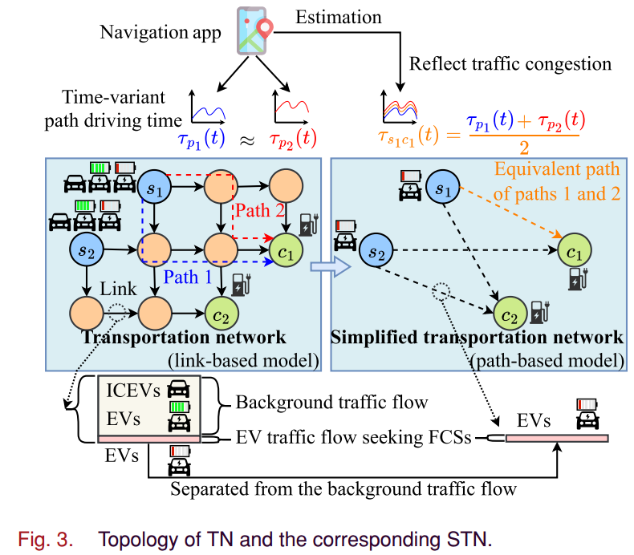
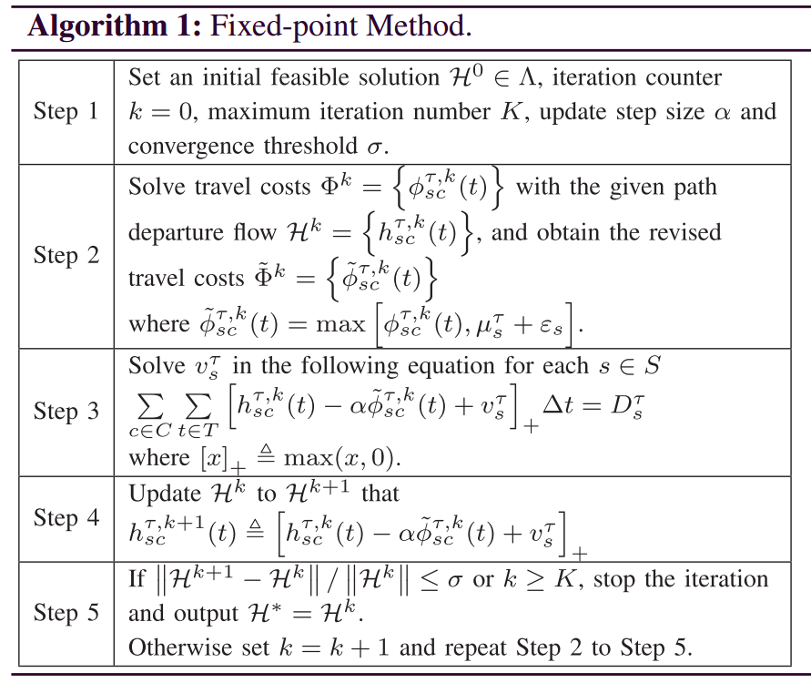
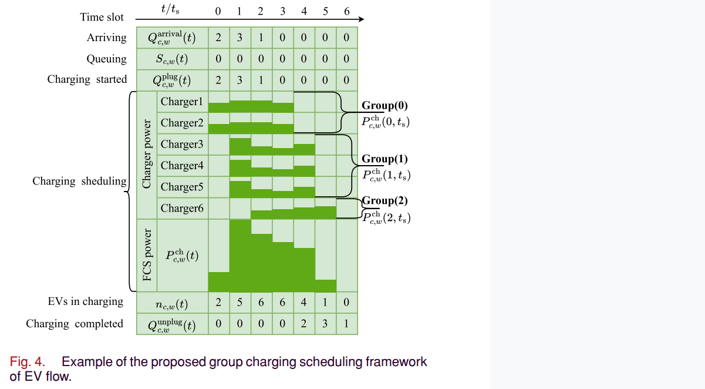
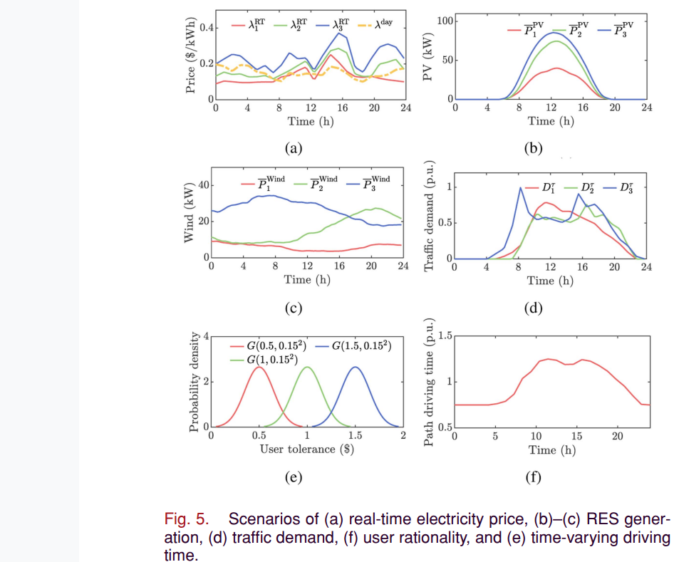
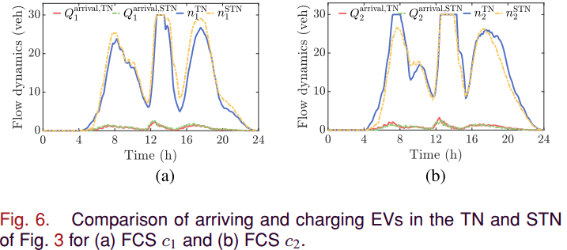
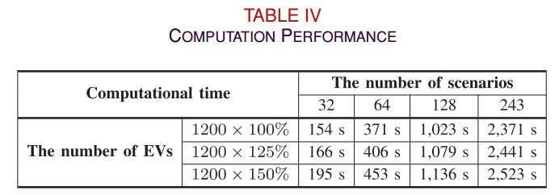

# 基本信息

[1] Y. Chen, Y. Zheng, S. Hu, S. Xie, and Q. Yang, “Optimal Operation of Fast Charging Station Aggregator in Uncertain Electricity Markets Considering Onsite Renewable Energy and Bounded EV User Rationality,” *IEEE Trans. Ind. Inf.*, vol. 20, no. 11, pp. 13384–13395, Nov. 2024.

24年11月；TII；Chen(浙大博士)

# 研究空白

有限理性；TN简化节省计算量；充电聚合减少决策变量；价-源-荷-有限理性的不确定性；

# 贡献

1）公式化：基于**TN缩减策略**提出了高效的BRDUE模型，重点关注有限理性下电动汽车的移动性和充电选择。为了减少不必要的计算复杂性，将具有充电需求的电动车交通流与其他背景交通流分开，并通过**无偏点队列模型**准确跟踪它们在FCS的充电动态（例如，到达、排队、充电和离开）。

2）策略：为FCSA设计了一个群组充电调度框架，以管理FCS上的大量快速充电电动汽车。具有相同充电需求的电动汽车自动**分组**并共享相同的FCS内的调度策略，显着减少了与充电调度相关的决策变量。

3）解决方案：综合考虑市场价格、可再生能源发电、流量需求和用户依赖的用户理性等不确定性，制定了双结算电力市场FCSA最优日前竞价和日内调度策略的随机规划模型。

### STN和流量分离

> 请注意，由于交通拥堵的演变，路径行驶时间可能会随时间变化，这可以从导航应用程序轻松获得。因此，网络简化策略对于现实世界的TN来说是即插即用的。此外，TN中这些复杂的中间结构被去除，这显着降低了计算复杂度。
>
> 路径行驶时间由该路径承载的交通流决定，可以通过 BPR 函数建模[23]。因此，路径行驶时间主要由背景交通流决定，可以将其视为寻求FCS的EV交通流的时变环境参数。
>
> 这种交通流分离策略将进一步降低计算复杂度。

### 有限理性建模与求解

ε ≥ 0 服从高斯分布 ε ∼ G(Exp(ε), Var(ε))；

##### BRDUE的计算方法（不动点方法）

### 分组充电调度

> 因此，FCSA 只需要优化 3 条充电功率曲线，而不是 6 条。
>
> 请注意，充电调度中决策变量的数量由 |Pch c,w| 的 FCS 数量、场景、仿真时间步长和充电时间步长决定。 = |C|×|W|×|T| × τ ch/Δt。决策变量的数量不会随着预定电动汽车数量的增加而增加。因此，所提出的群组充电调度策略可以很容易地采用来管理大量电动汽车。 

日前bidding和日内实时调度
$$
\begin{align}
&\mathcal{O} = \sum_{w \in W} \pi_w \left( \mathcal{R}_w - \mathcal{C}_w \right)\\
&\mathcal{R}_{w} = \sum_{s \in \mathcal{S}} \sum_{\tau \in \Tau} \sum_{c \in \mathcal{C}} \sum_{t \in \mathcal{T}} h_{sc,w}^{\tau}(t) \theta_{sc,w}(t).\\
&\mathcal{C}_{w} = \mathcal{C}^{\text{DA}} + \mathcal{C}_{w}^{\text{RT}}\\
&\mathcal{C}^{\text{DA}} = \sum_{t \in \mathcal{T}} \lambda^{\text{DA}}(t) E^{\text{DA}}(t)\\
&\begin{split}
&\mathcal{C}_{w}^{\text{RT}} = \sum_{c \in \mathcal{C}} \sum_{t \in \mathcal{T}} \left[ \lambda^{\text{ESS}} |P_{c,w}^{\text{ESS}}(t)| \Delta t + \lambda^{\text{PV}} P_{c,w}^{\text{PV}}(t) \Delta t \right. \\
&+ \lambda^{\text{wind}} P_{c,w}^{\text{wind}}(t) \Delta t ] + \sum_{t \in \mathcal{T}} \left[ \lambda_{w}^{\text{RT}}(t) \Delta E_{w}(t) + \mathcal{C}_{w}^{\text{pen}}(t) \right]\\
\end{split}\\
&\mathcal{C}_{w}^{\text{pen}}(t) =
\begin{cases}
\max\{0, [E^{\text{DA}}(t) - \omega^{+} E_{w}^{\text{RT}}(t)] \Delta \lambda_{w}(t)\}, & \Delta \lambda_{w}(t) \ge 0 \\
\max\{0, [E^{\text{DA}}(t) - \omega^{-} E_{w}^{\text{RT}}(t)] \Delta \lambda_{w}(t)\}, & \Delta \lambda_{w}(t) < 0
\end{cases}
\end{align}
$$

> $\pi$是场景概率，$\mathcal{R}_w$是收入，$\mathcal{C}_w$是成本，$E^\text{DA}$是日前电量bidding量，$E_{w}^{\text{RT}}(t)$是实际用电量；$\Delta \lambda_{w}(t) = \lambda_{w}^{\text{RT}}(t) - \lambda^{\text{DA}}(t)$是价差，$\omega^{\pm} = 1 \pm \omega^{0}$是调节不平衡电量的两个常数。
>
> 运营成本有两块：电量不平衡的金额+不平衡套利的惩罚。

### 实验数据

> 对不同场景，用k-means聚类出高中低三种，类别一共是$3^5=243$种；其中流量1p.u.为20辆；平均1200辆；驾驶时间与TN拥塞程度相关；

> STN求解后的流量，与TN的几乎一致，仅引入少量误差；
>
> 但不动点法中，一个迭代7次（3.42s），一个迭代33次（19.46s）；

> EV数量对求解时间影响不大，反而是场景数量对求解时间影响较大。
