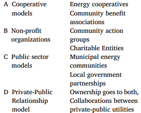
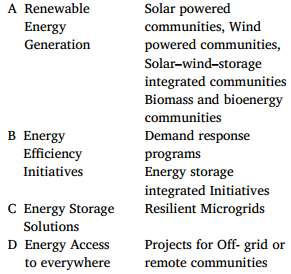
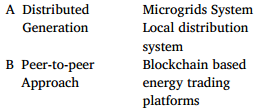
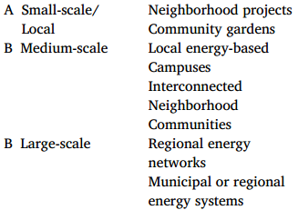
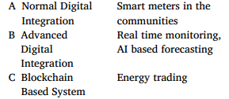
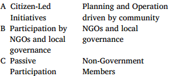

# 基本信息

26年3月；综述；Sepehrazad；意大利；管理与创新学院

# 关键词

学术界-工业界gap

# LEC

在参考文献[1]中，作者评估和分析了分散能源分配系统结构的不同方法，例如微电网、虚拟发电厂、能源中心、产消者社区团体、社区能源系统、综合能源系统和可再生社区团体。

> in Ref. [1], the authors have evaluated and analyzed different approaches of decentralized energy distribution system structures such as **microgrids**, **virtual power plants**, **energy hubs,** **prosumer community groups**, **community energy systems**, **integrated energy systems** and **renewable community groups**. 

# 分类

- 按组织结构分[11]
| 模式 | 实例 |
|:----:|:----:|
| A 合作模式 | 能源合作社，社区福利协会 |
| B 非营利组织   | 社区行动团体，慈善实体       |
| C 公共部门模式 | 市政能源社区，地方政府伙伴关系 |
| D 公私关系模式 | 所有权归双方所有，私人与公共事业之间的合作 |

- 按主目标分[12,13]
| 模式 | 实例 |
|:----:|:----:|
| A 可再生能源发电 | 太阳能社区、风能社区、光储一体化社区 生物质和生物能源社区 |
| B 能源效率举措   | 需求响应计划 储能综合举措       |
| C 能源存储解决方案 | 弹性微电网 |
| D 无处不在的能源接入 | 离网或偏远社区项目 |

- 按能源分配方法分[14]
| 模式 | 实例 |
|:----:|:----:|
| A 分布式发电 | 微电网系统 本地配电系统 |
| B 点对点方法   | 基于区块链的能源交易平台       |

- 按运营规模分[15]
| 模式 | 实例 |
|:----:|:----:|
| A 小型/当地 | 社区项目 社区花园 |
| B 中型   | 当地能源园区 互联邻里社区 |
| C 大型 | 区域能源网络 市政或区域能源系统 |

- 按框架分[16]
| 模式 | 实例 |
|:----:|:----:|
| A 法律和监管框架 | 可再生能源政策 净结论和上网电价 |
| B 财务模型   | 成员捐款 赠款和补贴 众筹       |
| C 技术框架 | 微电网/智能电网 智能电表和能源管理系统 |
| D 政策支持框架 | 政府措施 区域措施 |

- 按数字化集成程度分
| 模式 | 实例 |
|:----:|:----:|
| A 普通数字集成 | 社区智能电表 |
| B 高级数字集成    | 实时监控、基于人工智能的预测 |
| C 基于区块链的系统 | 能源交易 |

- 按利益相关者参与分
| 模式 | 实例 |
|:----:|:----:|
| A 公民主导的倡议 | 由社区驱动的规划和运营 |
| B 非政府组织和地方治理的参与    | 非政府组织和地方治理 |
| C 被动参与  | 非政府成员 |

## 全球项目综述

- 如今，欧盟在LEC的实施方面处于世界领先地位，有1500多个能源社区项目，3000多个能源社区地点，主要集中在德国和丹麦。
- 美国项目主要集中在加州，早期增长至少10%，并已向其他州蔓延，客户数量超过300万。
- 在印度，Gram Power 部署了一个智能微电网，由Rajasthan, Khareda Lakshmipura 的光伏发电，为家庭提供预付费智能电表、清洁太阳能和远程监控 [17]。
- 文献 [18] 基于中国情景，定量评估了微电网在政策驱动的本地化能源方案中的经济与技术可行性，并分析了其与新兴社区能源框架的衔接路径。

> Nowadays, the EU is leading the world LECs implementation with there are more than 1500 energy community projects, with more than 3000 energy community locations, manly focused in Germany and Denmark. The USA projects, mainly in California, are increasing early by at least 10 % and spreading also to the other states, with a number of customers above 3 millions. Community energy projects are being developed in India and China. In India, Gram Power has deployed a smart microgrid powered byphotovoltaics in the village of Khareda Lakshmipura, Rajasthan, serving households with prepaid smart meters, clean solar energy, and remote monitoring [17]. In China, the quantitative techno-economic analysis of microgrids supporting policy-driven, localized energy solutions and integration with emerging community energy frameworks was carried on in Ref. [18].

# LEC作用

- 1脱碳

根据**德国**社区能源配置的数据，与集中式系统相比，高产值 LEC 可以减少高达 35% 的温室气体排放 [21]。**欧盟**倡议中也报告了类似的结果，表明 LEC 在实现脱碳目标方面发挥着至关重要的作用 [22]。

>Also, high-prosumership LECs can cut GHG emissions by up to 35 % when compared to centralized systems, according to data from community energy configurations in Germany [21]. Comparable results have been reported in EU initiatives, suggesting that LECs play a crucial part in meeting decarbonization goals [22].

- 2减少主网需求
  - LEC 可以减轻发达国家和发展中国家主要集中式电网的压力。一个实证案例是**德国费尔德海姆**，该市通过社区拥有的风能和沼气系统实现了当地完全的电力和热力自治[26]。
  - 同样，在**东南亚**，太阳能和风能项目等分散式迷你电网显示出与集中式或主电网相比更容易获得电力的结果[27]，
  - 即使在**非洲**，开发离网所需的资本也比长距离输电项目所需的资本更少[28,29]。

>  However, there are some findings which evident that LECs can reduce the stress on the main centralized grid in both developed and developing nations. An empirical case is Feldheim, Germany, which achieved complete local electricity and heat autonomy through community-owned wind and biogas systems [26]. Similarly, in southeast Asia decentralized mini grids such as solar and wind projects show the outcome of reduced-price electricity with ease in access than compared to centralized or main grid [27], even in Africa also, developing an off-grid requires less capital than less capital than long-distance transmission projects [28,29].

- 3减少传输损耗
  - 当社区在其街区共享屋顶太阳能电池板或小型风力涡轮机时，电力的传输距离会更短，从而减少电阻损耗并提高系统效率。**葡萄牙**的研究表明，社区与可再生能源的结合可以减少高达 12% 的技术损失 [33]。
  - 此外，**国际能源署**强调，通过权力下放，可以将全球输电和配电损耗从目前某些地区大约 18% 的水平降低到 5% 左右的效率水平，从而显着减少二氧化碳排放。(撒哈拉以南非洲)

> When neighborhoods share rooftop solar panels or small wind turbines right on their block, the electricity has a shorter distance to travel, reducing resistive losses and enhancing the system’s efficiency. Studies in Portugal have shown that community integrated with Renewable sources can reduced technical losses by up to 12 % [33].

> Moreover, the International Energy Agency highlights that with decentralization, it is possible to reduce global transmission and distribution losses from current levels 18 % approximate in some region to an efficient level of around 5 %, which could significantly reduce CO2 emissions.

- 4增强电网稳定性

LEC通过整合电池等ESS来应对这一挑战，以在产量高时捕获多余的能量，并在产量低或需求高峰时释放它，从而确保稳定的能源供应。在**澳大利亚珀斯北部**，作为社区电池计划的一部分，由 119 个家庭共享的电池资源使参与家庭在高峰时段的电网用电量减少了 85% [38]。此外，NOBEL GRID 等**欧盟**资助的举措专注于为配电系统运营商和电力合作社开发先进的工具和 ICT 服务，旨在通过可再生能源发电和**需求响应系统**的集成（包括增强电压稳定性）来确保更加安全和稳定的电网[39]。总体而言，这表明配备智能控制和存储技术的LEC可以作为配电系统中的稳定节点。

> In northern Perth, Australia, a battery resource shared by 119 households, part of a community battery initiative, enabled an 85 % reduction in electricity consumption from the grid at peak times for participating households [38]. Furthermore, EU-funded initiatives like NOBEL GRID have focused on developing advanced tools and ICT services for Distribution System Operators and electric cooperatives, aiming to ensure more secure and stable grids through the integration of renewable generation and demand response systems, which includes enhancing voltage stability [39]. Overall, this suggests that LECs equipped with smart control and storage technologies can serve as stabilizing nodes in distribution systems.

- 5通过需求响应提高灵活性

来自**荷兰**的经验证据表明，基于社区的动态定价和自动化导致了高峰转移[42]。**瑞士**试点研究同样发现 LEC 参与者的需求响应灵活性高达 4.7% [43]。这些研究再次表明，需求侧的积极参与是本地能源社区具备适应能力的根本前提。

> Empirical evidence from the Netherlands shows that community-based dynamic pricing and automation led to peak shifting [42]. Swiss pilot studies similarly found demand response flexibility of up to 4.7 % among LEC participants [43]. These studies reinforce the role of demand-side engagement as a core enabler of LEC adaptability.

- 6实现P2P交易

在**纽约**，布鲁克林微电网使用区块链在居民之间实现了 P2P 交易，展示了当地市场的形成，并允许参与者将多余的太阳能发电出售给邻居[48]。在**印度**，勒克瑙太阳能交易试点使居民能够以低于中央市场价格 43% 的价格出售屋顶发电量，从而显着降低家庭电费[38,49]。这些案例表明，LEC在数字技术的支持下可以实现高效、去中心化的市场互动。

> In New York, the Brooklyn Microgrid enabled P2P trading among residents using blockchain, demonstrating local market formation and allowing participants to sell excess solar generation to neighbors [48]. In India, the Lucknow Solar Trading pilot enabled residents to sell rooftop electricity production at 43 % below the central market price, significantly reducing household electricity bills [38,49]. These cases suggest that LECs, supported by digital technologies, can enable efficient and decentralized market interactions.

- 7减少大型基础设施投资

一些报告称，与集中式电网扩展相比，**东非**的模块化离网 LEC 的投资成本降低了 30-40% [53,54]。这种方法在人口稀少或地形复杂的地区特别有效。因此，LEC 为传统的基础设施密集型扩展模式提供了经济高效的替代方案。

> Some reports that modular off-grid LECs in East Africa achieve 30–40 % lower investment costs compared to centralized grid extensions [53,54]. Such approaches are particularly effective in sparsely populated or topographically complex areas. Thus, LECs offer cost-effective alternatives to traditional infrastructure-heavy expansion models.

- 8拥塞管理的潜能

能源管理系统的案例研究证明了它们通过管理功耗来防止配电变压器过载的有效性[59,60,61]。**英国**的 Piclo Flex 平台还通过实现灵活的电力交易来解决网络限制，展示了社区灵活性服务在城市拥堵管理中的价值[62]。这些结果支持在**高需求条件**下使用 LEC 作为本地拥塞缓解机制。

> Case studies on energy management systems demonstrate their effectiveness in preventing overloading of distribution transformers by managing power consumption [59,60 [61]]. The UK’s Piclo Flex platform also demonstrated the value of community flexibility services in urban congestion management by enabling flexible electricity trades to solve network constraints [62].These results support the use of LECs as a local congestion relief mechanism under high-demand conditions.

- 9提高RES渗透率

欧洲各地由公民主导的举措已经部署了大量的可再生能源容量，强调社区模型在扩大可再生能源采用规模方面的潜力，估计已安装的可再生能源容量在 7.2 至 9.9 吉瓦之间 [67]。**丹麦**的萨姆索岛通过公民主导的举措实现了 100% 可再生能源自给自足，成为社区驱动的能源转型的全球范例 [68]。这些成果凸显了 LEC 作为加速可再生能源部署的社会基础平台。

> Citizen-led initiatives across Europe have deployed significant renewable energy capacity, emphasizing the potential of community models to scale RES adoption, with estimates ranging from 7.2 to 9.9 GW of installed renewable energy capacity [67]. Denmark’s Samsø Island reached 100 % renewable energy self-sufficiency through citizen-led initiatives, becoming a global example of a community-driven energy transition [68]. These outcomes highlight LECs as socially grounded platforms for accelerating renewable energy deployment.

- 10智能技术的需求

LEC结构是开发先进的数据驱动控制模型的合适平台，以满足智慧城市的要求[69]。在**奥地利**，智能社区计划正在制定可持续城市发展的开创性战略，整合先进技术以提高能源效率和资源管理[72,73]。**日本**的柏之叶智能城市也使用 LEC 框架（包括 AEMS 和物联网）来优化能源使用、管理分布式电源并降低峰值消耗 [74]。这些应用肯定了LEC作为城市和数字能源转型中能源创新平台的作用。

> In Austria, smart community initiatives are developing pioneering strategies for sustainable urban development, integrating advanced technologies to enhance energy efficiency and resource management [72,73]. Japan’s Kashiwanoha Smart City also uses LEC frameworks, including an AEMS and IoT, to optimize energy use, manage distributed power sources, and reduce peak consumption [74]. These applications affirm the role of LECs as platforms for energy innovation in urban and digital energy transitions.

# LEC建模与求解

- 交互：灵活性管理

发挥稳定性作用的是灵活性管理，结合了负荷转移、辅助服务和电网支持机制等技术，可以适应波动的能源负荷，也可以采用网络限制[92,93,95,101–104]。

> It is the flexibility management that plays the role of stability, incorporating techniques such as load shifting, ancillary services, and grid support mechanisms, which can accommodate the fluctuating energy loads and network restrictions can be adopted into the mix as well [92, 93,95,101–104].

- 交互：电力交易市场

在哥德堡和巴伦西亚进行的一些实际项目显示了LEC的经济和环境优势以及未来在配电网络中应用的潜力[83,86]。

> Some real projects that are performed in Gothenburg and Valencia show the economic and environmental advantages of LECs and the potential to be applied in the future in electrical distribution networks [83,86].

- 可再生能源不确定性

为了确保最快的改变，作者提出了一种使用AGD方法的分布式并行优化算法，该算法考虑了预测的不确定性直接作为模型的特征。由于热启动机制重用了上一步的最佳结果，以及限制通信延迟和保护用户隐私的轻量级虚拟协调层，因此提高了效率。该实现方法迄今为止证明了 SCS 更优越的性能，因为使用的平均 CPU 时间为 1.1 秒，明显低于 SCS（5.3 秒），并且只需要大约 12 次迭代，而不是大约 60 次。热启动功能在连续运行中将计算时间额外减少了 30%。这些增强功能提高了收敛速度和可扩展性，使得数百个参与者的实时操作成为可能，减少了通信开销，并即使在 PV 和负载大幅波动期间也能保护数据隐私。

> To ensure the fastest possible change, the authors came up with a distributed-parallel optimization algorithm using AGD method, which takes into account forecast uncertainty directly as the feature of the model. The efficiency is increased because of a warm start mechanism that reuses the best result of the last step, as well as a lightweight virtual coordination layer that limits communication delays and guards user privacy. The implementation method is demonstrated by far the more superior performance of the SCS since the average CPU time used is 1.1 s which is significantly lower than that of SCS (5.3 s) and only requires approximately 12 iterations instead of around 60. The warm-start feature provides an additional 30 % reduction in computation time in consecutive runs. These enhancements improve convergence speed and scalability, which makes real-time operation with hundreds of participants possible, reduces communication overhead, and preserves data privacy even during significant fluctuations in PV and load.

> AGD： Accelerated Gradient Descent

> SCS： Splitting Conic Solver (12年提出，随后接口集成到CVX、YALMIP)

