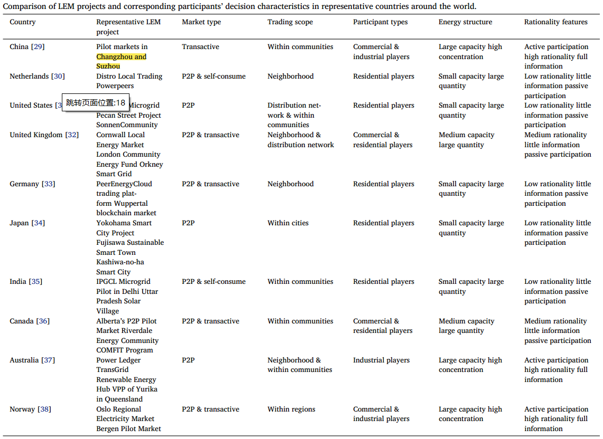
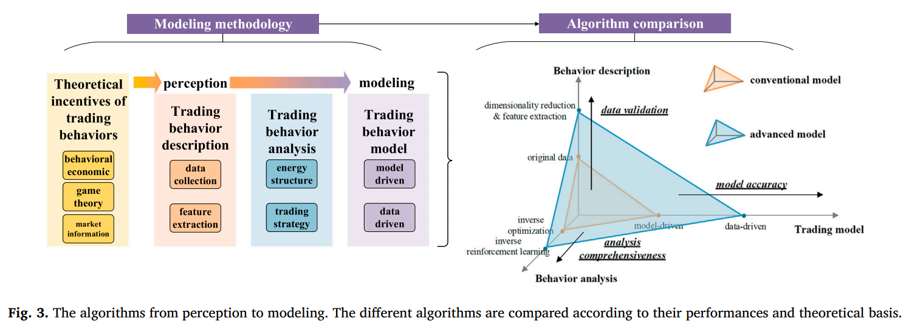
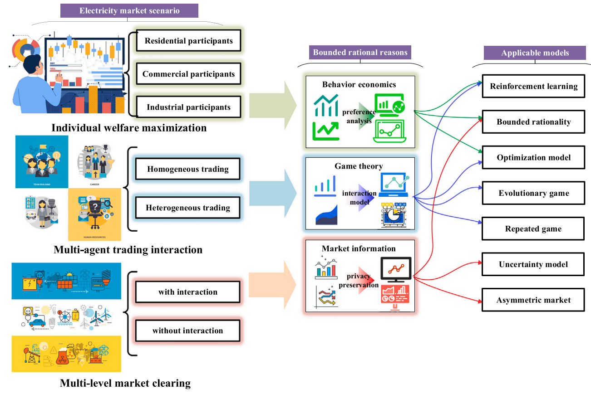

# 基本信息

26年3月；Renewable and Sustainable Energy Reviews；Xia（夏元兴，河海大学）

Bounded rational decision-making modeling and analysis in local energy markets: A state-of-the-art review

# 鼓励用户参加LEM的政策

许多国家都出台了相关能源政策，鼓励终端用户加入LEM。欧盟于 2018 年 6 月建立了产消合一法律框架，作为可再生能源指令 (RED II) 的一部分 [3]。

> Many countries have released relevant energy policies to encourage end-users to join LEMs. A legal framework for prosumer ship was established by the European Union as part of the Renewable Energy Directive (RED II) in June 2018 [3].

美国政府于 2021 年 4 月发布了 FERC 第 2222 号命令，以消除分布式能源 (DER) 进入本地和批发市场的障碍 [4]。

> The US government released FERC Order 2222 in April 2021 to remove the barriers preventing distributed energy resources (DERs) from joining local and wholesale markets [4].

德国政府于2000年颁布了《可再生能源法》，鼓励当地分布式能源的参与。因此，从 2006 年到 2020 年，德国的平准化电力成本下降了约 80% [5]。

> The German government published the Renewable Energy Sources Act in 2000 to encourage the local participation of DERs. The levelized cost of electricity in Germany consequently decreased by about 80 % from 2006 to 2020 [5]. 

# LEM实例

目前，LEM因其出色的性能而得到了广泛的部署和重视。 Power ledger 已成为 LEM 领域全球领先的实践者和研究贡献者，提供大规模实证试点和严格的学术分析。该公司的专有平台（例如 xGrid、uGrid）已在不同地区（包括澳大利亚、印度、泰国、奥地利和法国）部署，使太阳能+存储社区能够参与点对点电力交易，并明显降低电网出口/进口和参与者电力成本[7]。

> Currently, the LEM has been widely deployed and valued due to its outstanding performance. Power ledger has emerged as a globally leading practitioner and research contributor in the field of LEMs, delivering both large-scale empirical pilots and rigorous academic analyses. The company’s proprietary platforms (e.g., xGrid, uGrid) have been deployed across diverse geographies (including Australia, India, Thailand, Austria, and France), enabling solar-plus-storage communities to engage in peer-to-peer electricity trading with demonstrable reductions in grid exports/imports and participant electricity costs [7].

在西澳大利亚州的一项试点中，与一切照常 (BAU) 情景相比，纳入 BESS 后电网出口量减少了 28%，进口量减少了 33%，同时显着降低了参与者的账单。

> In one Western Australia pilot, the inclusion of BESS reduced grid exports by up to 28 % and imports by 33 % compared to the business-as-usual (BAU) scenario, while lowering participants’ bills significantly.

Power ledger 过渡到基于 Solana 的第三代 (Gen3) 区块链架构，提供增强的可扩展性、低延迟和节能的交易结算，解决第一代 DLT 系统的常见限制 [8]。

> Power ledger’s transition to a Solana-based third-generation (Gen3) blockchain architecture offers enhanced scalability, low latency, and energy-efficient transaction settling, addressing common limitations of first-generation DLT systems [8]. 

# LEM论文情况

如图 1b 所示，2023 年发表了 400 多篇讨论和建模 LEM 的论文，而 2019 年有关 LEM 的总发表数量不到 100 篇。

- 尽管出版物总数迅速增加，但仍缺乏对产消者参与机制异质性的系统研究，特别是从自我消费到主动市场参与的转变。
- 尽管LEM 被广泛认为可以提高当地可再生能源消费，但非理性行为对市场效率和交易结果（包括价格形成、网络利用率和公平性）的影响仍然没有充分量化。

# LEM参与者

在目前的LEM试点项目中，一般存在表3所示的三种类型的市场参与者，即住宅、商业和工业市场参与者。不同类型的市场参与者具有异质的交易特征。

- 住宅玩家负荷较低，但电器种类繁多。例如，住宅玩家有照明（电灯）、温度控制（电动空调）、通信（WiFi和电脑）和娱乐设备（电视）。他们还有电饭锅、电暖器等电热设备。照明和通信负载始终建模为刚性负载。温度控制、娱乐和电热负载可以建模为灵活负载（可减少和可转移的负载）。因此，住宅参与者可以调整其灵活负荷以最大化 LEM 利润 [39]。此外，大多数住宅企业没有大型发电和储能设备。他们还缺乏有效的能源管理系统（EMS）来优化其发电和消费策略[40]。因此，这些住宅企业通常表现出**非理性**、被动的市场参与行为。
- 商业参与者包括生产、生活和社会公共最终用户。这些商业参与者主要为最终用户的生产和日常活动提供服务。因此，它们的负载主要由空调和照明组成。与住宅玩家类似，这些商业玩家缺乏 EMS 来管理分散的电气设备。因此他们的负载率很低。然而，中央商业建筑中的空调和电动汽车（EV）停车场可以由玩家聚合和调度[41]。因此，他们具有**中等理性**。

- 与住宅和商业玩家相比，工业玩家通常具有更高的负载。因此，这些参与者安装 EMS 来优化调度其发电和消费 [42]。另外，它们的总负荷仅分为生产能耗和生产辅助能耗。凭借大型工业园区，这些参与者可以安装大型分布式能源用于自用。它们的能源生产和消费高度集中。很容易对这些集中的电力资源进行调度，以进一步提高工业参与者的利润[43]。行业参与者**理性程度高**，市场信息完整。然而，由于产能过剩，工业企业很难被纳入LEM。

大型工业参与者很难与其他小型LEM参与者进行有效的电力交易[44]。因此，LEM参与者大多是中低理性玩家。

# 电网约束(一笔带过)

网络约束LEM 通常依靠凸化或近似潮流模型（例如，直流潮流或 DistFlow）来捕获系统可行性和可靠性 [47]。

> Network-constrained LEMs typically rely on convexified or approximated power flow models (e.g., DC power flow or DistFlow) to capture system feasibility and reliability [47].

# 有限理性框架

- 行为建模
  -  主观理性[49]-[54]
  - 风险厌恶[55]-[62]
  - 心理账户[63]-[69]（意外之财更容易被花掉）
- 博弈建模
  - 演化博弈[71]-[76]
  - 重复博弈[77]-[81]  (声誉)
  - 合作博弈[82]-[85] (Shapley值)
  - 非合作博弈[86]-[88] (static non-cooperative/Stackelberg/Bayesian)

- 不完全市场信息建模
  - 不对称市场[90]-[94] (提出机制抑制不对称信息的影响)
  - 不确定建模[95]-[99] (SO/RO/DRO)
  - LEM不完全信息数学模型

文献[74]利用演化博弈框架探讨了中国可再生能源投资组合标准变化对市场均衡的影响。如果没有全局能源市场的视角，中国农村地区的小规模发电投资很难获得全局最优的结果。因此，Su等人[75]采用演化博弈框架来分析中国农村光伏装机投资均衡。

> The influences of the Renewable Portfolio Standards change in China on the market equilibrium were explored in [74] with an evolutionary game framework. Without a global perspective on the energy market, it is difficult to obtain globally optimal results for small-scale power generation investments in rural areas of China. Hence, Su et al [75] used an evolutionary game framework to analyze rural China’s PV installation investment equilibrium.

如果一个人拥有更多的信息，他就会获得更多的市场力量用于战略交易。对方无法做出最优的交易决策。

> If one person has more information, they will obtain more market power for strategic trading. The other person cannot make the optimal trading decision.

文献[148]对市场信息不对称导致的战略投资决策进行了分析。验证了不平衡的市场力量使投资均衡偏离理论上的最优解。抑制不对称市场中不平衡的市场力量仍然是一个有挑战性的问题。

> The strategic investment decisions caused by asymmetric market information were analyzed in [148]. The imbalanced market power was verified to make the investment equilibrium to deviate from the theoretically optimal solution. Suppressing the imbalanced market power in asymmetric markets remains a challenging problem to solve.

# 有限理性下的交易决策-研究现状

- 决策行为描述
  - 数据收集（交易偏好）
    - 交易数据
    - 环境数据
    - 内部数据。
  - 交易特征提取
    - 群体识别/关系提取
    - 降维算法
- 交易行为分析
  - 能源结构
  - 交易策略
- 决策行为建模
  - 模型驱动
  - 数据驱动
  - 强化学习

# 数据收集

交易数据包括产消者的有功电量交易记录，其粒度通常为15分钟或1小时[100]。交易数据记录在智能电表或当地能源交易平台中。

> The trading data includes the prosumers’ active power transaction records, which usually have a particle size of 15 min or one hour [100]. The trading data is recorded in smart meters or local energy trading platforms. 

环境数据包括温度、湿度、光照强度和风力[101]。这些因素影响产消者的能源生产和消费。因此，他们可以影响产消者的交易结果。

> The environmental data covers the temperature, humidity, light intensity, and wind force [101]. These elements impact the prosumers’ energy production and consumption. They can thus influence the prosumers’ trading results. 

内部数据包括家庭构成和能量结构，这些数据很难从外部检测到[102]。因此，为了获得这些数据，需要进行问卷调查和数据分析。

> The internal data includes the family composition and energy structure, which are hard to detect from the outside [102]. Therefore, a questionnaire survey and data analysis are necessary for obtaining these data.

# 特征提取

- 群体识别/关系提取

有几项工作直接利用所有收集到的数据来提取 LEM 参与者的特征。 Hahnel等人[103]进行了选择实验，考察社区能源价格和电池荷电状态对P2P能源交易结果的影响。选择实验中收集的数据直接用于识别具有特定交易特征的**四个目标群体**。 [104]建立了数据驱动的社交网络模型来提取**产消者的社交关系**。荷兰离散选择实验的数据在[105]中被用来验证产消者是否会为能源匮乏的家庭提供电力。

> The prosumers’ trading features can be extracted using the collected data. Several works directly employ all the collected data to extract the LEM participants’ features. Hahnel et al [103] carried out a choice experiment to examine the influences of community energy prices and battery state of charge on the P2P energy trading results. The collected data in the choice experiment were directly used to identify four target groups with specific trading features. A data-driven social network model was established in [104] to extract the prosumers’ social connections. The data from the discrete choice experiment in the Netherlands were employed in [105] to verify whether prosumers would provide electricity for energy-poor households. 

- 降维算法

虽然使用所有收集到的数据可以提供交易特征的综合分析，但高维数据增加了计算复杂度。

> Although using all collected data can provide comprehensive analysis of trading features, the high-dimensional data increase the computational complexity.

[106]提出了一种用于社区中 P2P 匹配的高级聚类模型。能源数量、买入/卖出价格和地理位置的数据集被聚类。 [107]中聚集了三组，对 P2P 能源市场中产消者的交易特征进行分类。请注意，聚类算法可能会导致有效信息的丢失。在降维之前先进行蒙特卡罗方法[108]和综合分类方法[109]。

> An advanced clustering model for P2P matching in communities was proposed in [106]. The datasets of energy quantity, bid/offer price, and geographic location were clustered. Three groups were clustered in [107] to classify the prosumers’ trading features in P2P energy markets. Note that the clustering algorithm may cause the loss of valid information. The Monte Carlo method [108] and comprehensive classification method [109] were conducted before reducing dimensions.

# 能源结构分析

目前的 LEM 参与者通常会安装智能电表，连接到上级电网。智能电表中记录的数据可用于非侵入式负载监控（NILM），以识别产消者的能源结构。一名能源产消者仅安装一台电表，所有能源生产和消耗数据序列都堆叠在一起。 NILM 技术无需安装更多仪表即可识别每个电器、分布式能源或储能的生产和消耗数据[110]。当前的NILM方法涵盖机器学习[111]、深度学习[112]和优化方法[113]。文献[114]提出了一种基于迁移学习的自适应一对多 NILM 模型，用于识别智能建筑中的所有设备。将负载轨迹输入深度卷积神经网络，以分析家用电器的开/关状态和住宅功耗[115]。尽管当前的NILM技术能够识别产消者的能源结构，但高频的电表采样（每秒一次或每分钟一次）对数据存储和传输提出了挑战。用较少的采样数据识别准确的能量结构仍然是一个重要的问题。

> The current LEM participants usually install a smart meter where they connect to the superior grid. The data recorded in smart meters can be used for **non-intrusive load monitoring (NILM)** to identify the prosumers’ energy structure. One energy prosumer only installs one meter, where all energy production and consumption data sequences are stacked together. The NILM technology identifies each electrical appliance, DER, or energy storage’s production and consumption data without installing more meters [110]. The current NILM methods cover machine learning [111], deep learning [112], and optimization methods [113]. An adaptive one-to-many NILM model was proposed in [114] based on transfer learning to identify all the appliances in smart buildings. The load trajectory was input into a deep convolutional neural network to profile household appliance on/off statuses and residential power consumption [115]. Although the current NILM technologies manage to identify the prosumers’ energy structure, the high-frequency meter sampling (once per second or once per minute) poses challenges to data storage and transmission. It remains a significant problem to identify the accurate energy structure with less sampling data.

# 交易策略分析

与能源结构不同，交易策略无法直接观察和记录。它是由产消者的交易需求和外部环境决定的。因此，根据历史交易数据和环境条件进行反向识别分析交易策略。假设产消者的交易决策是通过优化做出的。在这种情况下，这些产消者的交易策略可以适应优化参数（即交易价格）和相应的交易结果（即最优交易金额）[116]。这种逆向优化方法已被用来评估市场参与者的**边际能源生产成本、投标参数和负荷预测**[117,118]。与反向优化类似，市场参与者的博弈行为也可以用观察到的均衡和玩家参数来拟合[119]。然而，产消者的逆向优化需要事先的假设，这可能是不准确的。观察到的参数、均衡和交易结果可能无法完全反映模型特征，从而导致欠拟合问题。因此，反向强化学习的出现是为了克服反向优化的问题[120]。在没有奖励函数的情况下，收集环境数据和交易决策来推断决策模型的参数。采用马尔可夫决策过程代替特定的先验假设。从而保证识别精度[121]。

Different from the energy structure, the trading strategy cannot be observed and recorded directly. It is determined by the prosumers’ transaction demand and the external environment. Therefore, the trading strategies are analyzed with reverse identification based on historical trading data and environmental conditions. Suppose the prosumers’ trading decisions are made by optimization. In that case, these prosumers’ trading strategies can be fitted out with the optimization parameters (i.e., trading prices) and corresponding trading results (i.e., optimal trading amounts) [116]. Such **reverse optimization methods** have been employed to evaluate the market participants’ marginal energy production costs, bidding parameters, and load forecasts [117,118]. Similar to the reverse optimization, the market participants’ gaming behaviors can also be fitted out with the observed equilibrium and players’ parameters [119]. However, the prosumers’ reverse optimization requires prior assumptions, which may be inaccurate. The observed parameters, equilibrium, and trading results may not completely reflect the model characteristics, which causes underfitting problems. **Reverse reinforcement learning** is thus developed to overcome the problems of reverse optimization [120]. Without reward functions, the environment data and trading decisions are collected to infer the parameters of the decision model. The Markov decision process is employed instead of specific prior assumptions. The identification accuracy can thus be guaranteed [121].

# 模型驱动优化

上述交易描述和分析有助于定性分析LEM参与者的交易偏好。然而，LEM参与者的交易行为需要定量分析，以确定用户在特定边界条件下的反应。我们将当前的定量模型分为数据驱动方法和模型驱动方法。

基于传统经济假设，LEM参与者的优化模型在有限理性因素的影响下实现市场利润最大化。市场利润是LEM交易收入减去发电成本计算得出的。**前景理论**通常用于对产消者的非理性交易行为进行建模。为了在优化模型中考虑行为经济学，Xia等人[62]采用前景理论来修改目标函数。优化模型中考虑了损失厌恶引起的风险偏好。由于主观参数很难获得，本文为主观参数定义了不确定性集，以在没有确定性参数的情况下优化交易结果。 [122]中建立了一个自动化的 P2P 能源交易框架，以考虑 LEM 参与者对交易的看法。为了避免消极态度和参与度降低，Zhang 等人[123]采用**前景理论**来模拟 LEM 参与者的感知。 [124] 中开发了一个考虑技术和社会学方面的跨学科 P2P 能量共享框架。随机博弈论模拟了LEM参与者的交易行为。**请注意，模型驱动的方法隐含了 LEM 参与者强大的能源管理能力和高交易意愿的假设，这可能不适合小规模家庭产消者。**应开发**数据驱动**的方法来更好地描述产消者的行为。

# 数据驱动优化

能源交易模型是在特定边界条件下计算最优交易结果的方法。因此，可以根据历史边界条件和交易结果直接建立产消者的交易模型。**价格弹性模型**假设产消者的交易量变化与价格波动成正比[125]。然后可以根据收集的交易和价格数据导出回归模型。**消费者心理学**在价格弹性模型中加入了死区和饱和区，以覆盖产消者的反应行为[126]。这种回归算法不需要机制建模。因此，它们具有很强的通用性。然而，LEM参与者的反应具有一定程度的随机性[127]。收集的交易数据无法准确表征最终用户的行为。此外，产消者的能源生产和消费行为非常复杂。关于**边界条件**，它们的响应可能是高度非线性的[128]。尽管支持向量机[129]和深度神经网络[130]已经被用来克服这些问题，但计算时间长和数据获取困难将成为新的问题。

# 数据驱动强化学习

在没有特定假设或模型的情况下，强化学习将能源产消者恢复为智能代理。 LEM 参与者的交易过程被建模为马尔可夫决策过程。 LEM参与者的交易策略可以根据给定的奖励和环境进行调整。边界条件已融入环境中。 LEM参与者随后可以调整自己的交易策略（行动）以获得更高的市场利润（奖励）。由于强化学习算法可以无模型，因此具有更高的通用性和模型准确性。 **EV聚合商的出价策略**在[90]中基于数据分析和深度强化学习进行了优化。

强化学习可确保快速决策并减少对随机模型的依赖。 [131]中提出了一种无模型的以产消者为中心的协调方法，以消除基于模型的以系统为中心的方法的实际限制。采用真实的大规模系统案例验证了所提方法的有效性。智能能源社区中产消者的交易过程被建模为[132]中的马尔可夫决策过程，以找到接近最优的交易结果。经验重放机制在深度强化学习框架[133]中实现，以对事件驱动的 LEM 中的交易行为进行建模。强化学习算法不一定能计算出**最优交易解决方案**。然而，顺序决策过程类似于产消者的交易行为，可以刻画有限理性的交易行为。

